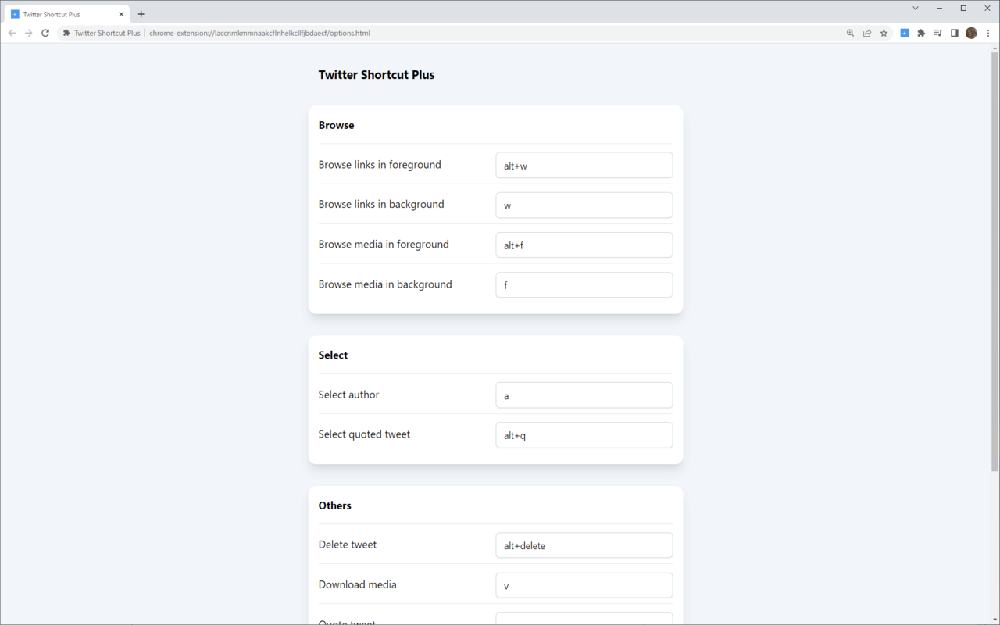

# Twitter Shortcut Plus

Browser extension to add more keyboard shortcuts to [twitter.com](https://twitter.com/).

## Keyboard shortcuts

### Browse

- Browse links in background (default: <kbd>w</kbd>)
- Browse links in foreground (default: <kbd>alt+w</kbd>)
- Browse media in background (default: <kbd>f</kbd>)
- Browse media in foreground (default: <kbd>alt+f</kbd>)

### Select

- Select author (default: <kbd>a</kbd>)
- Select quoted tweet (default: <kbd>alt+q</kbd>)

### Others

- Delete tweet (default: <kbd>alt+delete</kbd>)
- Download media (default: <kbd>v</kbd>)
- Quote tweet (default: <kbd>q</kbd>)
- Toggle pin tweet (default: <kbd>z</kbd>)

## Configuration

Customize the keyboard shortcuts from options page.

## Related project

- <https://github.com/r7kamura/tweetdeck-shortcut-plus>
